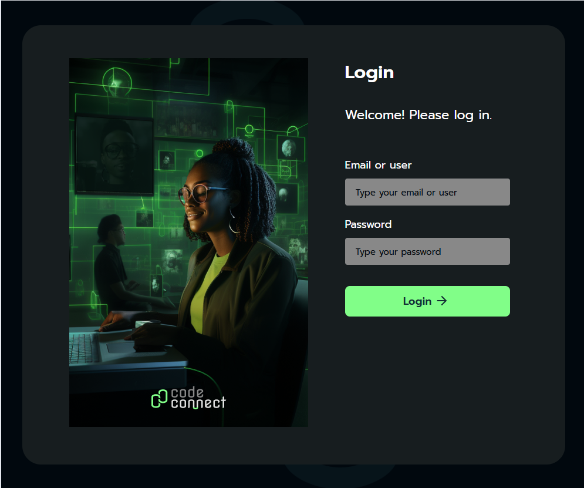

# CodeConnect

CodeConnect is a social network for developers created during the React: Components and JSX course. It features a login page with an image, email and password form, titles, and action links.

# Technologies: 
React, JSX, Babel, React-DOM, and component-based design.

